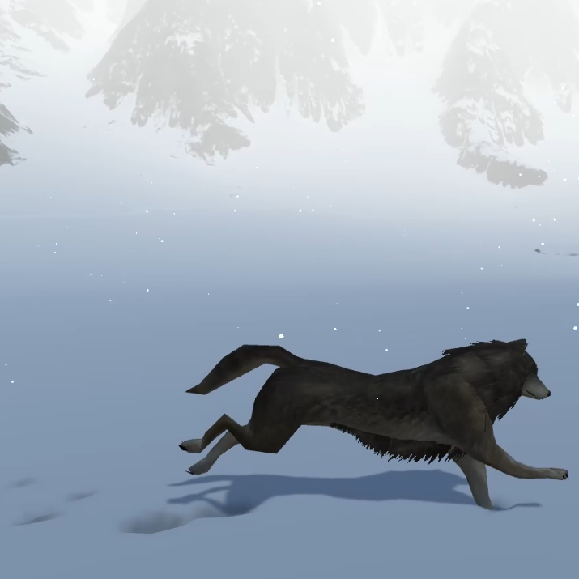

# WolfTracksTessellation
This project showcases tessellation-based snow tracks made in the Unity game engine. The main character is a wolf with a walk, run and idle animations. The user controls the movement of the wolf and the camera rotation. The scene contains snowy mountain environment with fog and a snow particle system. Every polygon in plane on which wolf moves is tessellated based on the distance from the camera. Every footstep is accompanied by a snow track on that spot, color change and a sound. Over time snow accumulates so that the tracks disappear slowly.

Running
In Tessellation build folder run Računalna grafika-Tessellation.exe. 
Unity project is in folder Tessellation project. Project is made with Unity version 2019.2.10f1.
Controls
•	W/arrow up-forward
•	S/arrow down-backwards
•	A/arrow left - left
•	D/arrow right - right
•	Left Shift- while pressed down wolf will run
•	M-Show/Hide snow track texture
•	+ na numeričkoj tipkovnici- zoom in snow track texture
•	- na numeričkoj tipkovnici- zoom out snow trak texture
•	Mouse movement-camera rotation

Used assets
Wolf
https://sketchfab.com/3d-models/wolf-with-animations-f3769a474a714ebbbaca0d97f9b0a5a0
Mountains
https://sketchfab.com/3d-models/snowy-mountain-terrain-9fa3c56fd32746bcb0e06cd2c4229ca0
Wind sound
https://www.zapsplat.com/music/very-strong-howling-wind-recorded-in-field/
Footsteps
https://www.zapsplat.com/music/single-footstep-on-snow-1/
